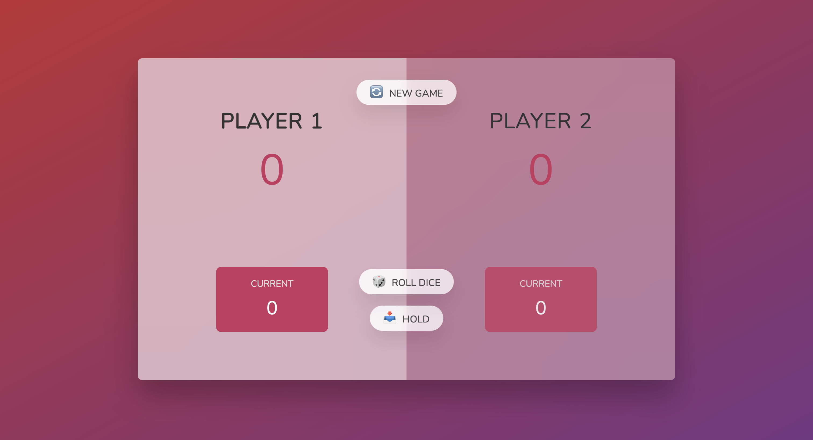
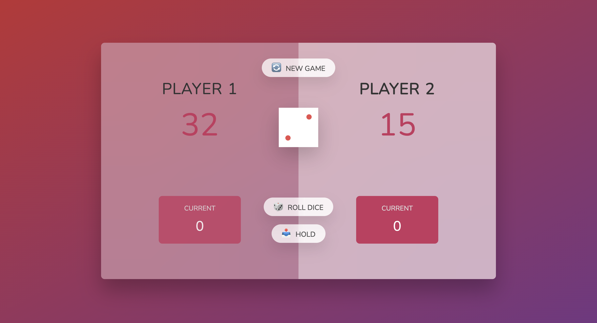
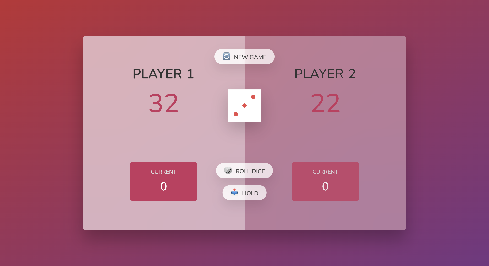
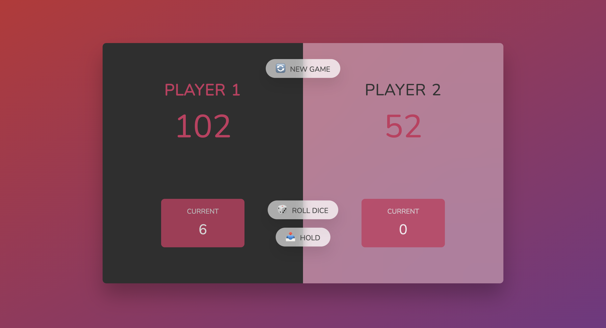

# 🎲 Pig Game
A fun, interactive 2-player dice game where players take turns rolling a die to reach 100 points first. Be careful! Rolling a 1 switches the turn.

# 🚀 How to Play
1. Roll the Dice 🎲
Click "Roll Dice" to roll.
The number adds to your current score unless you roll a 1.

2. Hold Your Score 📥
Click "Hold" to add your current score to the total score and pass the turn.

3. Winning Condition 🏆
First player to reach 100 points wins!

4. Start a New Game 🔄
Click "New Game" to reset and play again.

# 📸 Screenshots

# 🛠️ Technologies Used
HTML – Structure
CSS – Styling
JavaScript – Game Logic
